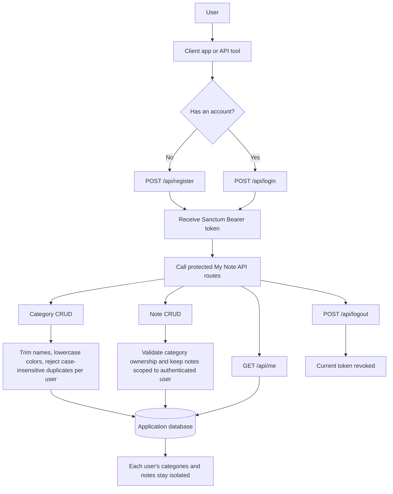

# My Note Laravel

[](https://app.codacy.com/gh/yoesuv/My-Note-Laravel/dashboard?utm_source=gh&utm_medium=referral&utm_content=&utm_campaign=Badge_grade) [](https://app.codacy.com/gh/yoesuv/My-Note-Laravel/dashboard?utm_source=gh&utm_medium=referral&utm_content=&utm_campaign=Badge_coverage)

My Note Laravel is a Laravel 13 API application for user authentication, category management, and note management. It uses Laravel Sanctum Bearer tokens for API authentication and follows a layered backend structure: `Controller -> Service -> Repository`.

## Current Status

- Laravel application built on `laravel/framework` `^13.8` and PHP `^8.3`.
- Sanctum token authentication is installed and used for protected API routes.
- Public authentication endpoints are available for registration and login.
- Protected endpoints are available for the authenticated user profile, logout, categories, and notes.
- Categories are user-scoped and enforce case-insensitive name uniqueness per user.
- Notes are user-scoped and must belong to one of the authenticated user's categories.
- API documentation exists in `docs/` for auth, categories, and notes.
- Feature tests cover auth, categories, notes, and repository behavior.

## Tech Stack

- **Backend:** Laravel 13, PHP 8.3+
- **Authentication:** Laravel Sanctum API tokens
- **Database:** SQLite by default in `.env.example`; MySQL intended for local app development if configured in `.env`
- **Frontend tooling:** Vite 8, Tailwind CSS 4, `laravel-vite-plugin`
- **Testing:** PHPUnit 12 with SQLite in-memory database
- **Formatting:** Laravel Pint

## Requirements

- PHP `^8.3`
- Composer
- Node.js and npm
- SQLite for quick setup, or MySQL for local app development

## Quick Setup

Use the project setup script for a first-time install:

```bash
composer run setup
```

This command will:

1. Install Composer dependencies.
2. Copy `.env.example` to `.env` if `.env` does not exist.
3. Generate `APP_KEY`.
4. Run database migrations.
5. Install npm dependencies with `--ignore-scripts`.
6. Build frontend assets.

> Note: `.npmrc` disables npm scripts by default. Use `npm install --ignore-scripts` if installing npm dependencies manually.

## Manual Setup

If you prefer to run each step manually:

```bash
composer install
cp .env.example .env
php artisan key:generate
php artisan migrate
npm install --ignore-scripts
npm run build
```

If you want seed data for local development:

```bash
php artisan db:seed
```

Seed data includes:

- User: `test@example.com`
- Password: `password`
- Default categories: `Personal`, `Work`, `Ideas`
- Example notes under those categories

## Database Configuration

`.env.example` defaults to SQLite:

```env
DB_CONNECTION=sqlite
```

For local MySQL development, update only your local `.env` file:

```env
DB_CONNECTION=mysql
DB_HOST=127.0.0.1
DB_PORT=3306
DB_DATABASE=my_note_laravel
DB_USERNAME=root
DB_PASSWORD=
```

Then run:

```bash
php artisan migrate --seed
```

Do not commit real database credentials.

## Running the App

Start the full local development stack:

```bash
composer run dev
```

This runs Laravel's development server, queue listener, Pail logs, and Vite together.

Useful individual commands:

```bash
php artisan serve
npm run dev
npm run build
```

## API Overview

All API routes are defined in `routes/api.php`.

### API Flow

The flowchart below shows the typical client flow: register or login, receive a Sanctum Bearer token, then use protected category and note endpoints.



### Public Routes

| Method | Endpoint        | Description                                |
| ------ | --------------- | ------------------------------------------ |
| `POST` | `/api/register` | Register a user and return a Sanctum token |
| `POST` | `/api/login`    | Login and return a Sanctum token           |

### Protected Routes

Protected routes require:

```http
Authorization: Bearer <token>
Accept: application/json
```

| Method      | Endpoint                     | Description                                      |
| ----------- | ---------------------------- | ------------------------------------------------ |
| `GET`       | `/api/me`                    | Return the authenticated user                    |
| `POST`      | `/api/logout`                | Revoke the current token                         |
| `GET`       | `/api/categories`            | List categories                                  |
| `POST`      | `/api/categories`            | Create a category                                |
| `GET`       | `/api/categories/{category}` | Show a category                                  |
| `PUT/PATCH` | `/api/categories/{category}` | Update a category                                |
| `DELETE`    | `/api/categories/{category}` | Delete a category                                |
| `GET`       | `/api/notes`                 | List notes, optionally filtered by `category_id` |
| `POST`      | `/api/notes`                 | Create a note                                    |
| `GET`       | `/api/notes/{note}`          | Show a note                                      |
| `PUT/PATCH` | `/api/notes/{note}`          | Update a note                                    |
| `DELETE`    | `/api/notes/{note}`          | Delete a note                                    |

Route IDs for categories and notes are constrained to numeric values. Malformed IDs return `404`.

## API Documentation

Detailed endpoint documentation is available in:

- [API Register](docs/register.md)
- [API Login](docs/login.md)
- [API Categories](docs/categories.md)
- [API Notes](docs/notes.md)

Recommended reading path:

1. Start with [API Register](docs/register.md) or [API Login](docs/login.md) to get a token.
2. Read [API Categories](docs/categories.md) because notes require a category.
3. Read [API Notes](docs/notes.md) for note CRUD and filtering behavior.

## Development Conventions

- API auth uses Sanctum with `auth:sanctum` middleware.
- Auth, category, and note features follow `Controller -> Service -> Repository`.
- API responses expose `full_name`, while the database stores the value in `users.name`.
- Login returns a generic invalid credentials message for unknown email and wrong password.
- Category names are trimmed before validation and storage.
- Category names are unique per user case-insensitively through `categories.name_normalized`.
- Category colors are stored as lowercase 6-digit hex strings, for example `#f39c12`.
- Notes are always scoped to the authenticated user.
- A note's `category_id` must reference a category owned by the authenticated user.

## Testing

Run all backend tests:

```bash
composer run test
```

Run a focused test:

```bash
php artisan test --filter=NoteTest
```

Testing uses SQLite in-memory through `phpunit.xml`:

```xml
<env name="DB_CONNECTION" value="sqlite"/>
<env name="DB_DATABASE" value=":memory:"/>
```

This means tests do not use your local MySQL database unless the test configuration is changed.

## Code Style

Format PHP code with Laravel Pint:

```bash
./vendor/bin/pint
```

## Project Structure

Important locations:

```txt
app/Http/Controllers/Api/   API controllers
app/Http/Requests/          Form request validation
app/Http/Resources/         API response resources
app/Models/                 Eloquent models
app/Repositories/           Persistence layer
app/Services/               Business logic layer
database/migrations/        Database schema
database/seeders/           Local seed data
docs/                       API documentation
routes/api.php              API routes
routes/web.php              Web routes
tests/                      PHPUnit tests
```

## License

This project is open-sourced software licensed under the [MIT license](https://opensource.org/licenses/MIT).
